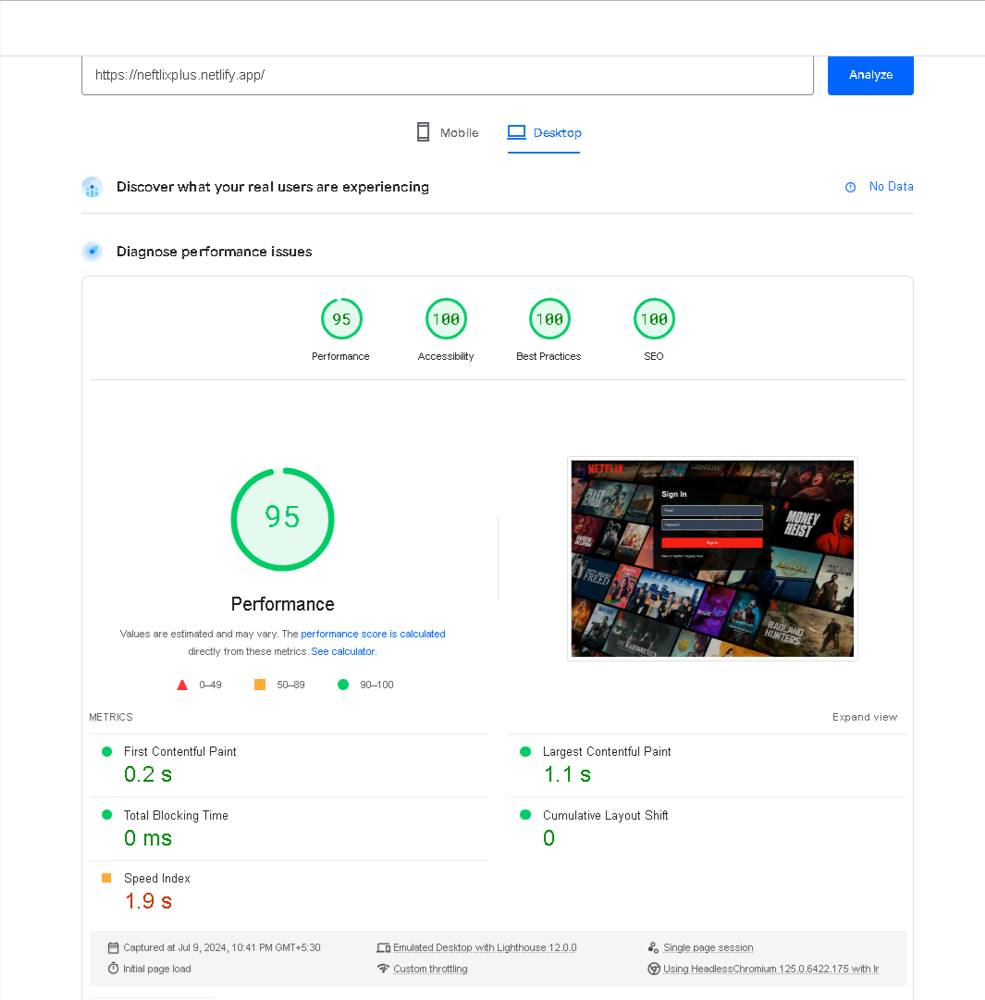

## NETFLIX-PLUS (GO THROUGH WHOLE README TO UNDERSTAND THE PROJECT PROPERLY)

[SEE VIDEO DEMO HERE ](https://www.loom.com/share/bf2cafe6cac34db99d80ef63d22a7669)

## LIVE LINK WON'T WORK (SOMETIMES) ⚠️⚠️

The website might give you this error (see screenshort below). I have reported it to Google for being marked this website as phishing, and I hope it gets updated soon. Meanwhile, you can still visit the website by clicking the 'Details' button and then clicking on 'Visit this unsafe site' to proceed.

Also, my project uses the Gemini API and TMDb API, so it might occasionally face issues due to:

- **Gemini API Limitation:** There is a daily limit on the number of fetch requests.
- **TMDb API Downtime:** The TMDb API server is often down in India. (Quick Solve -> using VPN)

## FOR LOGGING PURPOSE ⭐

**Email : testuser@gmail.com**
**Password: Test1234**

## WEB PERFOMANCE AND OPTIMIZATION 😮😮

### Goal: ⭐

To enhance the website's performance, ensuring it loads quickly and provides a smooth user experience.

### Generated Report: ⭐

After implementing various optimization strategies, a detailed performance report was generated. You can view the full analysis [here](https://pagespeed.web.dev/analysis/https-neftlixplus-netlify-app/gk8p0c9bc2?form_factor=desktop).

### Achieved Results: ⭐

- **First Contentful Paint (FCP):** 0.2s
  FCP measures the time it takes for the browser to render the first piece of content from the DOM.

- **Largest Contentful Paint (LCP):** 1.1s  
  LCP measures the time it takes for the browser to render the largest content element on the page.

- **Total Blocking Time (TBT):** 0 ms  
  TBT indicates the total time the main thread is blocked during page load, preventing other tasks from running.

- **Cumulative Layout Shift (CLS):** 0  
  CLS measures the sum of all unexpected layout shifts of visible elements during page load.

- **Speed Index:** 1.9s
  Speed Index shows how quickly the contents of a page are visibly populated.

### Implemented Strategies:

- **Debouncing in Search:** Implemented debouncing to prevent excessive calls during user input.
- **Code Optimization:** Streamlined and optimized the codebase for better performance.
- **Redux Store for Caching:** Cached frequently used data across the app, including a multilingual feature.
- **Code Splitting:** Divided code into smaller chunks for faster initial load times.
- **Efficient JSX Rendering:** Rendered components conditionally based on data, reducing unnecessary load on the browser.
- **Checked Critical Rendering Path (CRP) Concepts:** Ensured no render-blocking CSS or parser-blocking JavaScript was used, and removed unused or duplicate CSS.

## Features (PLANNING)

- Browse Route after authentication (LOGGED IN)

  - Header
  - Background Movie Playing (Main Movie)

    - Trailer in Background
    - Title and Description

    - Movie Suggestions
      - Movie Lists \* N

- When LOGGED OUT

  - Home Page '/' route
  - Signup / Signip Page along with button
    - Sign In / Sign Up form
    - redirect to Browse Page

- NetflixPlus (GPT API)
  - Search Bar
  - Movie Suggestions

## STEPS

    - Create React App
    - Configured TailwindCSS
    - Header
    - Routing
    - Login/SignIn Form
    - Signup Form
    - Form Validation (Regex) && Use Ref Hook
    - Firebase Setup & Deploying our app to Production
    - Create SignUp user account && SignIn using Firebase
    - Push the USER info into Redux Store
    - Implemented Signout
    - Display Name
    - Get Data from TMDB api Lists
    - Movie Trailer with Title and Description
    - Completed Browse page with dynamic movie sections
    - GPT (Gemini) Search Feature
    - normal - mobile , sm- tab, md - desktop

## REACT - REDUX (A BRIEF UNDERSTANDING)

    $npm install --save redux react-redux

    Difficult to give states (Names,Address, ProdilePic..etc) to severalcomponents in bigger application when we need. It creates a global state for the whole application, that can be accessed by any of your component. It is a state management library

    Shop               Shopkeeper    Customer
    States Store <---> Reducer <---> Action

    store: it brings the actions and reducers together, holding and changing the state for the whole app — there is only one store.

    reducers: these are functions that implement the behavior of the actions. They change the state of the app, based on the action description and the state change description.

    actions: these are objects that should have two properties, one describing the type of action, and one describing what should be changed in the app state.

    createStore() -> accepts param xyz reducer
    getState() -> method to give access to state it holds
    dispatch(action) -> method allow state to be updated
    subscribe(listener) -> method by which we can register listeners. This method accept function listeners as a parameter which execute anytime when the state in redux changes.

    <Provider store={}>App<Provider/> -> connect our app with Redux and pass any store to it as a prop

    Hooks + React Redux -> useSelector Hook - access states from store. It accepts selector fn as a params, which accepts the state a argumant and returns a value.

    Hooks + React Redux -> useDispatch Hook - returns a reference to the dispatch function from redux store.
